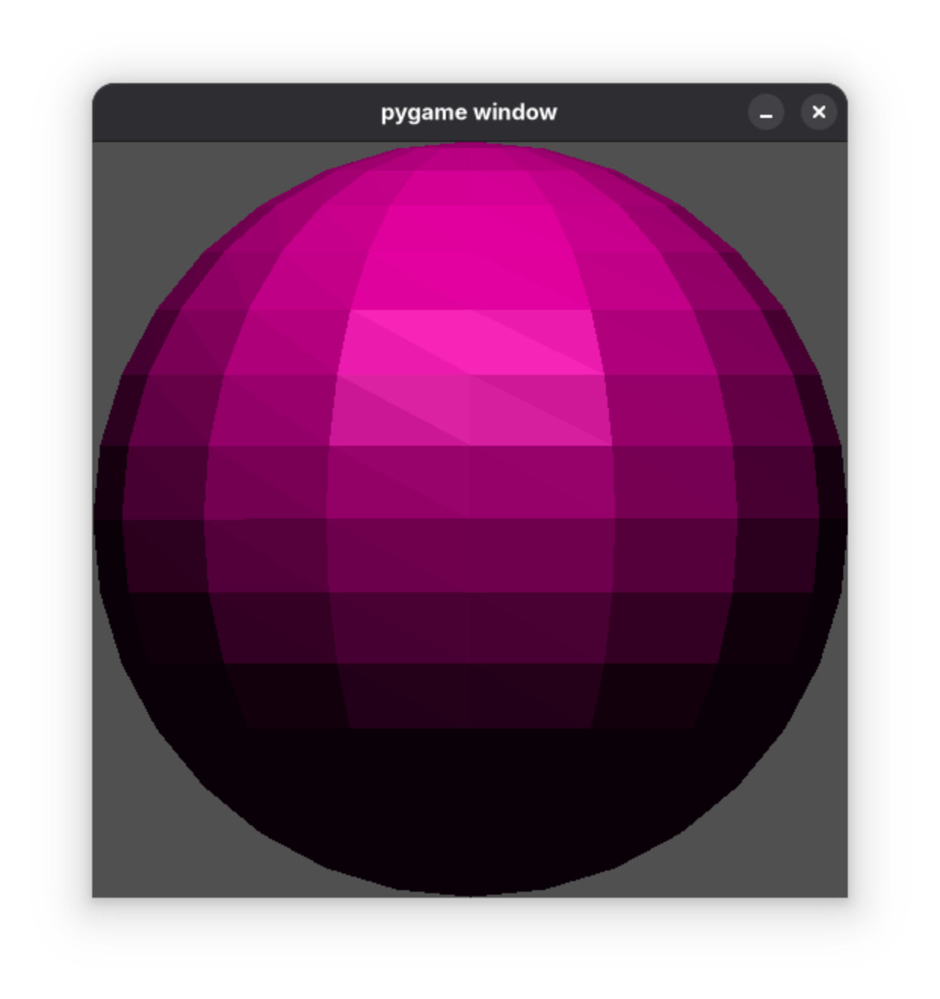
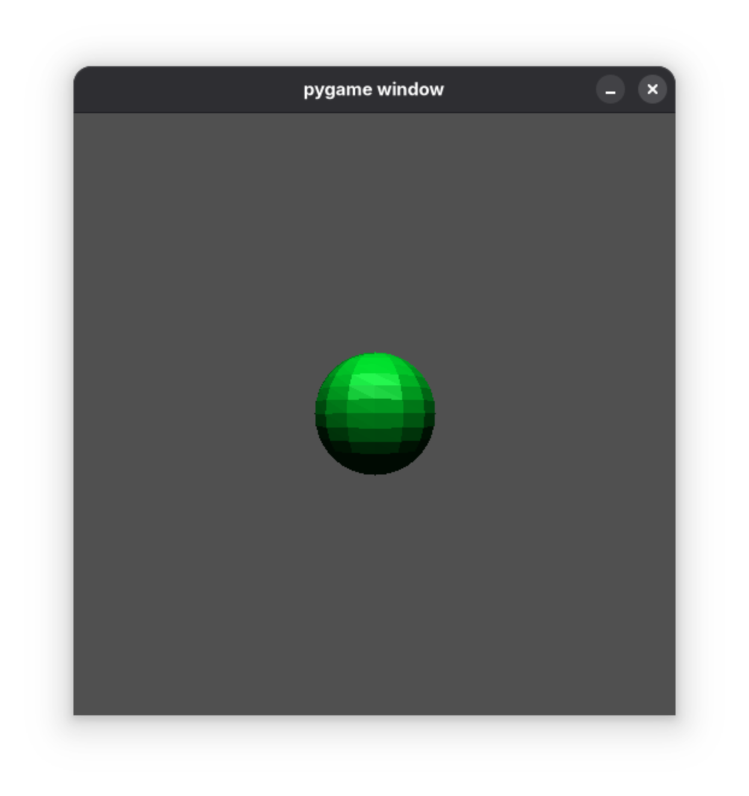
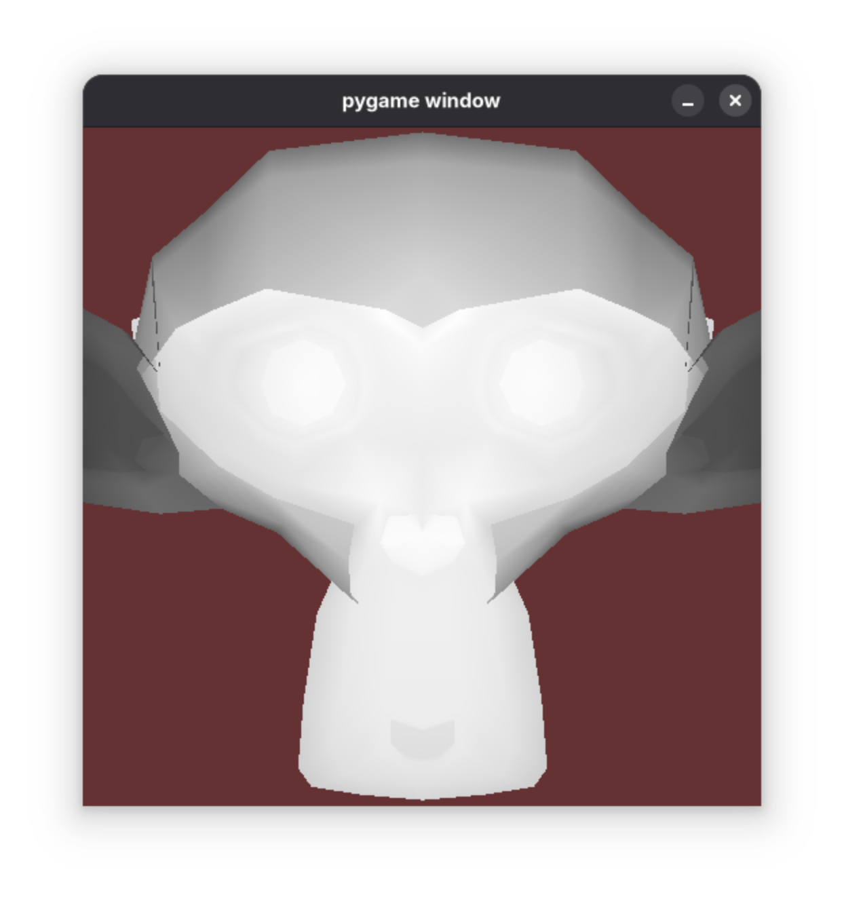

# Programming Assignment 5

## Overview

In this programming assignment, you are going to complete the fifth step towards building our renderer: extending the camera module, adding the light module, and extending the renderer module to support flat shading. To begin, you will extend the camera module created in the last assignment by adding a `PerspectiveCamera` class. Extending the renderer module to support flat shading will require adding a light module with a `PointLight` class.


## Instructions

To begin, you will extend the renderer module created in the last assignment by updating the inputs to the `render` function that account for `shading` type, `ambient_light` in the scene. Next, you will create the `PointLight` class within `light.py` to define a simple point light and update `Mesh` to be include members representing the material properties necessary for lighting computation.

This assignment as two primary objectives:

First, you will modify `camera.py`, and add a class called `PerspectiveCamera`. `PerspectiveCamera` is almost identical to `OrthoCamera`, and needs to be implemented as detailed below. As the name suggests, `PerspectiveCamera` will provide the functions necessary to perform a perspective projection transformation (as opposed to an orthographic projection transformation).

Second, we will implement flat shading as the `flat` rendering mode, in which the color is determined at the center of each face, and that color is used for every fragment of the face. The color calculation should compute the ambient, diffuse, and specular components. Your shading implemention should make use of the normal direction to cull back faces of each mesh (and a z-buffer should not need to be implemented yet). The depth value after projection should be used for depth clipping, by only rendering surface points that are within the bounds of -1 and 1, i.e., between the near and far planes.

This assignment will only make use of visual checks to validate your solutions.


### Output

There is a total of 3 scripts that can be executed (including the extra credit script).

This is the expected output when `assignment5_orthographic.py` is run:

```bash
python assignment5_orthographic.py
```



This is the expected output when `assignment5_perspective.py` is run:

```bash
python assignment5_perspective.py
```



### Dependency Management
Each assignment will include a requirements.txt file that includes the python package requirements for the assignment. If you are using PyCharm it should automatically detect and install the dependencies when you create the virtual environment. Otherwise, [these instructions](https://www.jetbrains.com/help/pycharm/managing-dependencies.html#configure-requirements) will help you manually manage the requirements in PyCharm. If you are using something other than PyCharm, you can use the command line to manually install the packages from the requirements.txt file:

```bash
pip install -r requirements.txt
```

## The `PerspectiveCamera` Class (in `camera.py`)

### Exposed Members

#### `transform`
A `Transform` object exposed to set the orientation (position and rotation) of the camera. This should default to 
represent a position of `(0, 0, 0)` and no rotation.

### Exposed Methods

#### `__init__(self, left, right, bottom, top, near, far)`
The constructor takes six floats as arguments: `left` ,  `right`,  `bottom`,  `top`,  `near`, and `far`. These 
arguments define the orthographic projection of the camera used to construct the orthographic transformation. You 
can then use the `near` and `far` values to construct the perspective matrix. Using these two matrices is how you 
then convert a point from camera space to device space in the method `project_point`. You should also construct the 
inverse matrices for both the orthographic and projective transformations, as those will both be used in the method 
`project_inverse_point`. The camera `transform` should be initialized with the `Transform` default constructor.

#### `ratio(self)`
This method simply returns a float that is the ratio of the camera projection plane's width to height. That is, if the screen width is 6 in world space and the screen height is 3, then this method would return `2.0`.

#### `project_point(self, p)`
This method takes a 3 element Numpy array, `p`, that represents a 3D point in world space as input. It then 
transforms `p` to the camera coordinate system before performing the perspective projection using  
and returns the resulting 3 element Numpy array.

#### `inverse_project_point(self, p)`
This method takes a 3 element Numpy array, `p`, that represents a 3D point in normalized device coordinates as input. It then transforms `p` to the camera coordinate system before transforming back to world space returns the resulting 3 element Numpy array.

## The `PointLight` class (in `light.py`)

### Exposed Members

#### `transform`
A `Transform` object exposed to set the orientation (position and rotation) of the camera. This should default to represent a position of `(0, 0, 0)` and no rotation.

#### `intensity`
A scalar value representing the intensity, or brightness of the light source.

#### `color`
A 3 element (RGB) array representing the color of the light source using values between `0.0` and `1.0`.

### Exposed Methods

#### `__init__(self, intensity, color)`
The constructor should take values that populate the intensity and color members.

## Update to the `Mesh` class

### Updated Methods

#### `__init__(self, diffuse_color, specular_color, ka, kd, ks, p)`
The constructor now takes diffuse and specular color as an 3 element np array with all three values between `0.0` and `1.0`, as well as material properties `ka`, `kd`, `ks`, and `p`.

#### `from_stl(stl_path, diffuse_color, specular_color, ka, kd, ks, p)`
This static method takes an stl file as input, initializes an empty Mesh object using the input material properties `diffuse_color, specular_color, ka, kd, ks, p` and populates the `verts`, `faces`, and `normals` member variables. The method returns the populated Mesh object.


## Update to the `Renderer` class (in `renderer.py`)

### Updated Methods

#### `__init__(self, screen, camera, meshe, light)`
The class constructor takes a screen object (of type `Screen`), camera object (either of type `OrthoCamera` or `PerspectiveCamera`), a mesh object (of type `Mesh`), and a light source (of type `PointLight`) and stores them.

#### `render(self, shading, bg_color, ambient_light)`
This method will now take a three input arguments. `shading` is a string parameter indicating which type of shading to apply, for this assignment `flat` should be implemented (in addition to `silhouette` and `barycentric` from the previous assignment). `bg_color` is a three element list that is to be the background color of the render (that is, all of the pixels that are not part of a mesh). `ambient_light` defines the intensity and color of any ambient lighting to add within the scene. `render` will execute the basic render loop that we discussed in class and compute shading at each pixel fragment to update an image buffer. It will then draw that image buffer to  the `screen` object using the `screen.draw` method, but it will not run the pygame loop (the calling function will call `screen.show`)


## Extra Credit (2 points)
Extra credit for this assignment will be to add another capability to the render loop. Specifically, you will add a depth shader (the render method `shader` argument will have the value `"depth"`) that assigns the color of each fragment a grayscale value between `[0, 0, 0]` and `[255, 255, 255]` depending on the `y` value of the fragment in the canonical view volume (image space). The value should be scaled such that the farthest possible fragment (at the vertex with the largest y value) would be colored black and the closest possible fragment (at the vertex with the smalletst y value) would be colored white. All other fragments should be linearly interpolated between those two colors depending on the fragment's y value. The extra credit file is already created, and you should not modify it. The expected output is shown below:

```bash
python extracredit.py
```




## Rubric
There are 20 points (22 with extra credit) for this assignment:
- *8 pts*: running `assignment5_orthographic.py` shows the expected image
- *12 pts*: running `assignment5_perspective.py` shows the expected image
- *-3 pts*: the renders are missing the specular highlight
- *-3 pts*: the renders are missing the ambient lighting
